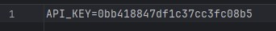
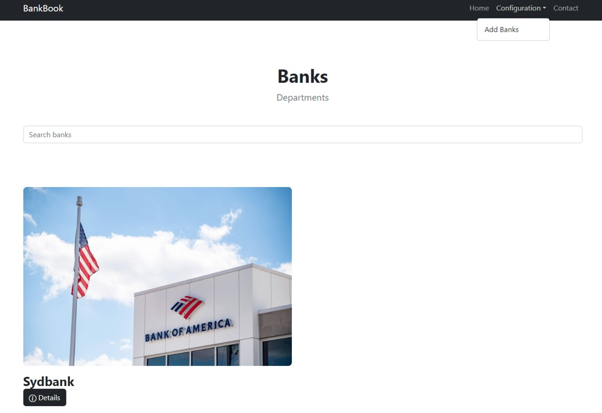
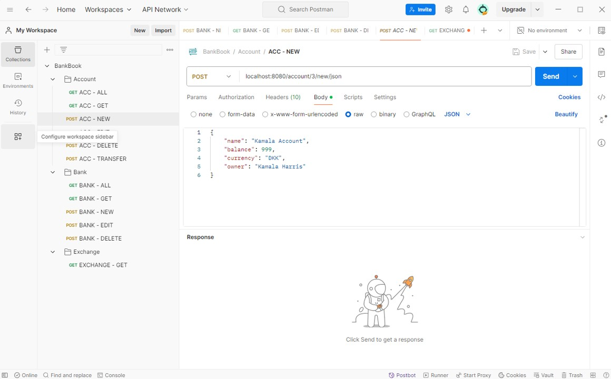

## BankBook:
- Author: Daniel H. Bjørnskov

### How to start application:
Prerequisite: Docker + Java 22 (maven build of jar) installed + port 3306 and 8080 should be available.
1. Clone project to local IDE.
2. Create an .env-file in the 'spring'-directory and provide API-key for exchange service. 
Syntax: API_KEY={your_or_my_key_here} (see image below to 'copy' mine)



3. Build Jar with maven.

```mvn package```

4. Start Docker Compose session from 'spring'-directory.

```docker compose -f docker-compose.yml up --remove-orphans --detach```

5. Open a browser and navigate to localhost:8080.
   Here you will find a simple HMI to navigate through the same API-interfaces as the REST-interface. (except for exchange API)
   The image below show what you can expect to see.



6. Open Postman (or similar API-testing tool) and use the following API (sorted by method GET/POST):

- Bank
  - GET - Get all banks
    - Path: ```localhost:8080/banks/json```
  - GET - Find specific bank by ID.
    - Path: ```localhost:8080/bank/${bankId}/json``` 
  - POST - Create new bank
      - Path: ```localhost:8080/bank/new/json```
      - Header: Content-Type - application/json
      - Body:
      ```
      {
      "id": "123",
      "name": "New Bank",
      "address": "Højvang 15",
      "phone": "004512345678",
      "imageUrl": "https://t4.ftcdn.net/jpg/00/61/06/27/360_F_61062796_NF87GPnWV0fQ2LhoYNlyjev0PocRwZj9.jpg",
      "email": "DAJA@bank.com",
      "rating": 3
      }
      ```
  - POST - Edit existing bank
      - Path: ```localhost:8080/bank/${bankId}/edit/json```
      - Header: Content-Type - application/json
      - Body:
      ```
      {
      "id": 1,
      "name": "Lille Bank",
      "address": "Nyvangsvej 36G",
      "phone": "004512345678",
      "imageUrl": "https://t4.ftcdn.net/jpg/00/61/06/27/360_F_61062796_NF87GPnWV0fQ2LhoYNlyjev0PocRwZj9.jpg",
      "email": "bank@bank.com",
      "rating": 3
      }
      ```
    - POST - Delete existing bank
        - Path: ```localhost:8080/bank/${bankId}/delete/json```
   

- Account
    - GET - Get all accounts
        - Path: ```localhost:8080/accounts/json```
    - GET - Find specific account by ID.
        - Path: ```localhost:8080/account/${accountId}/json```
    - POST - Create new account
      - Path: ```localhost:8080/account/${bankId}/new/json```
      - Header: Content-Type - application/json
      - Body:
      ```
      {
      "name": "Kamala Account",
      "balance": 999,
      "currency": "DKK",
      "owner": "Kamala Harris"
      }
      ```
    - POST - Edit existing account
      - Path: ```localhost:8080/account/${accountId}/edit/json```
      - Header: Content-Type - application/json
      - Body:
      ```
      {
      "id" : 1,
      "name" : "Saving Account",
      "currency" : "DKK",
      "balance" : 2000,
      "owner" : "J. Edgar Hoover",
      "created" : null,
      "modified" : [ 2024, 9, 8, 9, 33, 43, 374904000 ]
      }
      ```
    - POST - Delete existing account
      - Path: ```localhost:8080/account/${accountId}/delete/json```
    - POST - Transfer money from one account to another
      - Path: ```localhost:8080/account/transfer/json```
      - Header: Content-Type - application/json
      - Body:
      ```
      {
      "fromAccountId": 1,
      "toAccountId": 2,
      "amount": 20
      }
      ```

- Exchange
  - GET - Get exchange rate of any currency compared to DKK (USD, NOK etc...)
    - Path: localhost:8080/exchange/${currencyShortName}/json

Example image:



